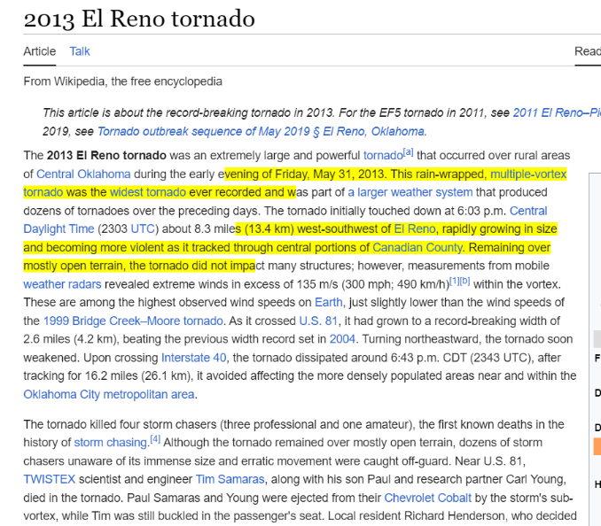

# Web Annotator Extension

## Overview

The Web Annotator Extension is a browser extension that allows users to annotate web pages by drawing, highlighting text, adding notes, and saving their annotations for later use. This tool enhances productivity by enabling users to mark up content directly within their browser.

## Features

- **Pen Tool:** Draw on the webpage using different colors.
- **Highlighter Tool:** Highlight text in different colors.
- **Add Note Tool:** Add textual notes to the webpage.
- **Undo:** Undo the last annotation action.
- **Save Annotations:** Save your annotations for future reference.
- **Color Selector:** Choose different colors for the pen and highlighter tools.

## File Structure

- **popup.html:** Contains the HTML structure for the extension's popup UI.
- **styles.css:** Defines the CSS styles for the extension's UI components.
- **popup.js:** Contains the JavaScript for handling user interactions and sending messages to the content script.
- **background.js:** Manages the extension's background tasks, including saving and loading annotations.

## Installation

1. Clone the repository or download the project files.
2. Open your browser and navigate to the extensions page (e.g., `chrome://extensions` for Chrome).
3. Enable "Developer mode" if it's not already enabled.
4. Click on "Load unpacked" and select the project directory.
5. The Web Annotator Extension should now appear in your browser's extension list.

## Usage

1. Click on the extension icon to open the popup UI.
   
   
2. Use the buttons to select the desired tool (pen, highlighter, note, undo, save).

   
3. For the pen and highlighter tools, select a color from the color selector.
4. Annotate the webpage as needed.

   
5. Click "Save" to save your annotations. Saved annotations will be restored when you revisit the page.

## Contribution

Contributions are welcome! If you find any issues or have suggestions for improvements, please create an issue or a pull request.

## License

This project is licensed under the MIT License.
